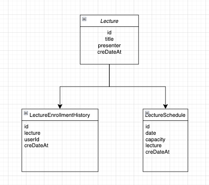

## ERD


### 테이블 설계 이유

- 핵심 기능인 특강 신청에 초점을 맞추어 설계를 진행 했습니다.
- 특강을 신청하기 위해선 특강 신청을 저장할 수 있는 히스토리 테이블이 있겠지만, <br>
  그 전에 메타데이터인 특강 테이블이 필요 합니다.

```
{
    "id" : 1L,
    "title" : 허재 코치님의 라이브 특강,
    "presenter" : 허재,
    "schudule" : 
        {
            "특강 시간" : 2024-10-10 13:00,
            "수용 인원" : 30명
        },
        {
            "특강 시간" : 2024-10-11 13:00,
            "수용 인원" : 30명
        },
        {
            "특강 시간" : 2024-10-12 13:00,
            "수용 인원" : 30명
        },
}
```
이런 형태의 메타데이터 구축을 하였습니다. 그래서 신청하게 된다면 아래와 같은 형태로 신청을 받게 됩니다.
```
{
    "id" : 1L,
    "userId" : 이정기,
    "lectureId" : 1L
}
```

신청 히스토리에 Lecture 에 대한 키를 저장함으로서 신청 히스토리를 조회할 때 Lecture 테이블 <br>
조인을 통해 Lecture 에 대한 정보를 가져올 수 있습니다. 또한 특강에 정보가 추가 된다 하더라도 <br>
키 값을 통해 쉽게 추가 정보를 가져 올 수 있기 때문에 이런 형태로 테이블 설계를 진행 했습니다.


